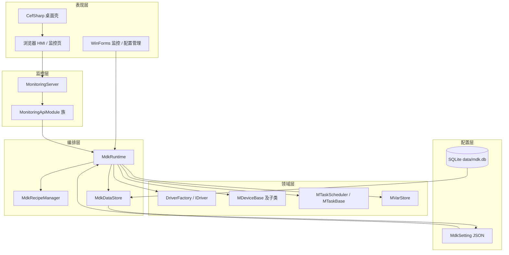
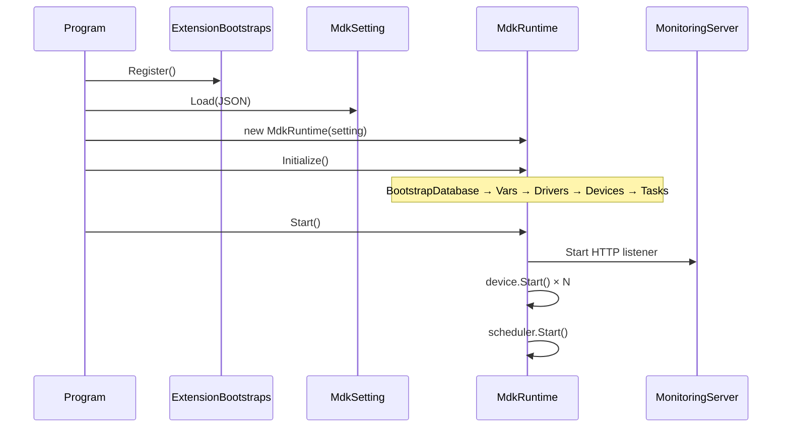

# 总体架构

MDKOSS（Open Source Simplified Runtime）是从 `MDKSYS/mdkruntime` 提炼的开源简化运行时。设计目标是：**最小依赖、可编译、可运行、可观测、可扩展**。

## 设计原则

- **配置驱动**：工程行为由 JSON 描述，运行时按配置实例化驱动、设备与任务。
- **分层解耦**：配置 → 编排 → 驱动 → 设备 → 任务 → 状态 → 监控，各层通过接口与注册表扩展。
- **可观测**：内置 `HttpListener` 监控服务，提供 HMI 页面与 REST 快照/控制 API。
- **渐进扩展**：Core 保留内核；串口/TCP 等可选能力放在 `MDKOSS.Extensions`，通过注册表接入。

## 分层架构



| 层级 | 主要类型 | 职责 |
|------|----------|------|
| Configuration | `MdkSetting` | 从 JSON 加载工程定义 |
| Runtime Orchestration | `MdkRuntime` | 生命周期、组件注册、快照、设备动作 |
| Driver | `IDriver`, `DriverFactory` | 硬件/仿真抽象，读写 IO、轴等 |
| Device | `MDeviceBase` 子类 | 将驱动能力组合为 GPIO、平台、串口等业务设备 |
| Task | `MTaskScheduler`, `MTaskBase` | 周期任务、操作序列、心跳轮询 |
| State | `MVarStore`, `MdkRecipeManager` | 线程安全变量与配方预设 |
| Data | `MdkDataStore` | 排单、示教点、配方与 SQLite 同步 |
| Monitoring | `MonitoringServer` | HTTP 静态页 + 模块化 REST API |
| Presentation | WinForms / CEF | 桌面壳、配置编辑器、运行时管理窗口 |

## 解决方案组成

```text
MDKOSS.sln
├── src/MDKOSS.Sample/         # Demo / console 可执行入口（嵌入 CEF）
├── src/MDKOSS.Cef/            # CefSharp 界面库 + views
├── src/MDKOSS.Config/         # WinForms 配置界面可执行入口
├── src/MDKOSS.Core/           # 运行时内核（core/、server/、tasks/、host/）
├── src/MDKOSS.Extensions/           # 扩展接入接口（IMdkExtension / Host）
├── src/MDKOSS.Drivers.Sim/          # sim 驱动插件
├── src/MDKOSS.Drivers.Gts/          # gts 驱动插件
├── src/MDKOSS.Drivers.Dmc/          # LTDMC 原生绑定
├── src/MDKOSS.Extensions.Serial/    # serialdev
├── src/MDKOSS.Extensions.Tcp/       # tcpdev
├── src/MDKOSS.Extensions.Camera/    # extcamera
├── src/MDKOSS.Extensions.PyScript/  # devpyscript
├── examples/pnp/                    # PNP 机型示例
└── tests/MDKOSS.Tests/              # xUnit（按 Core/Config 等项目分子目录）
```

应用启动时调用 `MdkExtensionHost.DiscoverAndRegister()` 扫描 `plugins/` 自动注册驱动与设备扩展，再创建 `MdkRuntime`。详见 [extensions.md](./extensions.md)。

## 生命周期

### 启动顺序



`Initialize()` 内部顺序（见 `MdkRuntime.Initialize`）：

1. **BootstrapDatabase** — 打开 SQLite，同步配方，加载排单到变量
2. **BootstrapVars** — 写入配置中的 `vars`，应用 `activeRecipeId`
3. **BootstrapDrivers** — `DriverFactory.Create` 并 `Initialize`
4. **BootstrapDevices** — 按类型构建设备（Core 内置 + `DeviceExtensionRegistry`）
5. **BootstrapTasks** — `RuntimeTaskFactory.Create` 并注册到调度器

`Start()` 顺序：

1. 启动 `MonitoringServer`（默认 `http://127.0.0.1:5080/`）
2. 启动所有已注册设备
3. 启动任务调度器，置 `IsRunning = true`

### 停止与释放

1. `StopAsync()`：先停调度器，再停设备，最后停监控 HTTP
2. `Dispose()`：释放驱动/设备/调度器，将配方写回 SQLite，关闭数据库与日志

## 数据流概览

```mermaid
flowchart LR
    JSON[setting.json] --> MR[MdkRuntime]
    MR --> DRV[Drivers]
    DRV --> DEV[Devices]
    DEV --> VS[Vars]
    TS[Tasks] --> DEV
    TS --> VS
    MR --> SNAP[RuntimeSnapshot]
    SNAP --> API[/api/status]
    WEB[监控页] --> API
    WF[WinForms] --> MR
```

- **下行（配置 → 运行）**：JSON 描述驱动参数、设备绑定、任务间隔；运行时只读 `MdkSetting`，不在此路径热重载。
- **上行（运行 → 观测）**：`GetSnapshot()` 聚合驱动/设备/变量/任务状态，供 HTTP 与 WinForms 轮询。
- **控制（外部 → 设备）**：`POST /api/devices/{id}/action`、`POST /api/io/write` 等经 `MdkRuntime` 分发到具体设备。

## UI 模式

| 项目 / 参数 | 说明 |
|-------------|------|
| `MDKOSS.Config` | `MainForm` 托管运行时，提供配置管理与监控工具 |
| `MDKOSS.Sample` | Demo / PNP 宿主；嵌入 CEF HMI；可选 `--console` 无 GUI |
| `MDKOSS.Cef` | CefSharp 界面库（`CefMainForm` / `views`），由 Sample 引用 |

详见 [gui.md](./gui.md)。

## 与 mdkruntime 的关系

- MDKOSS **不追求**与 mdkruntime 功能全量对齐。
- **继承**的核心思想：配置驱动、设备抽象、任务调度、状态中心、运行态可观测。
- **暂不纳入**（第一阶段）：完整 Nancy 模块体系、Redis 同步、插件热插拔、复杂服务编排。

MDKOSS 作为轻量内核与教学/验证基线，可按需渐进扩展。

## 延伸阅读

- [project-layout.md](./project-layout.md) — 目录与文件映射
- [core-subsystems.md](./core-subsystems.md) — 各子系统细节
- [monitoring-api.md](./monitoring-api.md) — HTTP 端点清单
