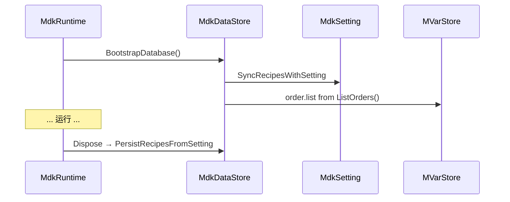

# 数据持久化（SQLite）

MDKOSS 使用 **Microsoft.Data.Sqlite** 持久化配方同步、生产排单与平台示教点。运行时通过 `MdkDataStore` 访问，由 `MdkRuntime` 在启动/关闭时协调与 JSON 配置的同步。

## 数据库位置

- 配置项：`MdkSetting.databasePath`
- 默认：`data/mdk.db`（相对 `AppContext.BaseDirectory`）
- 常量：`MdkSetting.DefaultDatabasePath`

`MdkRuntime` 构造时：`DataStore = new MdkDataStore(ResolveDatabasePath(setting))`

## 核心类型

| 类型 | 文件 | 职责 |
|------|------|------|
| `MdkDatabase` | `mdk_database.cs` | 连接、迁移、原始 SQL 执行 |
| `MdkDataStore` | `mdk_data_store.cs` | 业务 API：订单、配方、示教点 |
| `MdkDataModels` | `mdk_data_models.cs` | 记录 DTO |

## 生命周期中的数据流

### 启动（BootstrapDatabase）

1. 记录数据库路径日志
2. `SyncRecipesWithSetting(Setting)` — JSON recipes 与 DB 双向对齐
3. `ListOrders()` — 若有排单，序列化写入 vars 键 `order.list`（`MdkDataStore.OrderListVarKey`）

### 关闭（Dispose）

- `PersistRecipesFromSetting(Setting)` — 将内存中配方写回 SQLite
- 关闭数据库连接

## 生产排单（production_orders）

`OrdersApiModule` 暴露 REST CRUD：

- 字段包括：产品、数量、状态、进度、关联 `recipe_id`、优先级、备注、时间戳
- 列表默认按优先级降序、创建时间升序
- 支持按 `status` 过滤

排单数据 **不** 嵌入 `setting.json`，仅存在于 SQLite，通过 API 与 vars 缓存暴露给 UI。

## 示教点（teach）

`TeachApiModule` 管理平台示教点文件与点位：

- 按 `platformId` 组织
- 支持列出文件、读写/删除单个示教点
- 供 `monitorPlatform.html` 与 WinForms 示教功能使用

具体表结构见 `MdkDatabase` 迁移脚本。

## 配方同步

配方在 JSON 与 DB 间同步，保证：

- 配置文件中定义的 `recipes` 可导入数据库
- 运行时通过 API 修改的配方在退出时写回 DB
- `MdkRecipeManager` 操作的 vars 与 `RecipeConfig` 一致

启动时若 `activeRecipeId` 无效，记录警告但不阻止启动。

## 与变量中心的关系

| 键 | 来源 | 用途 |
|----|------|------|
| `order.list` | DataStore 启动加载 | 监控/UI 展示排单摘要 |
| `recipe.activeId` / `recipe.activeName` | RecipeManager | 当前配方标识 |

## 测试

`tests/MDKOSS.Tests/MdkRecipeTests.cs` 等用例覆盖配方与 API 行为；测试输出目录下可生成独立 `data/mdk.db`。

## 延伸阅读

- [configuration.md](./configuration.md) — recipes / activeRecipeId 字段
- [core-subsystems.md](./core-subsystems.md) — MdkRecipeManager
- [monitoring-api.md](./monitoring-api.md) — `/api/orders`、`/api/teach`、`/api/recipes`
