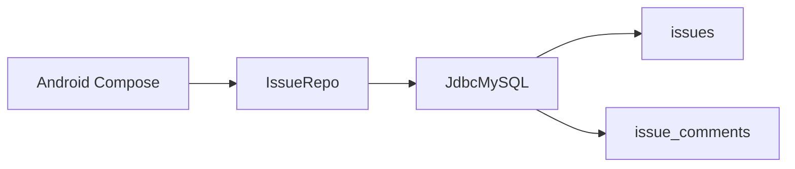

# Issue 提交与管理

面向现场/调试人员的缺陷与需求跟踪：数据在公网 MySQL `mdkossdb`，Android 应用 JDBC 直连，无登录（报告人姓名存在手机本地）。

密码不进仓库。连接账号在应用「设置」里填写，只保存在本机 SharedPreferences。



## 库表

库：`mysql6.sqlpub.com:3311` / `mdkossdb`（MySQL 8.4）。DDL 可重复执行：

```bash
python scripts/mdkossdb/init_schema.py
```

脚本：`scripts/mdkossdb/schema_issues.sql`。

### issues

| 列 | 类型 | 说明 |
|----|------|------|
| id | BIGINT PK AI | |
| title | VARCHAR(200) | 标题 |
| body | TEXT | 描述 |
| type | ENUM | `bug` / `feature` / `question` / `other` |
| priority | ENUM | `low` / `medium` / `high` / `critical` |
| status | ENUM | `open` / `in_progress` / `resolved` / `closed` |
| reporter | VARCHAR(64) | 报告人 |
| assignee | VARCHAR(64) | 指派人，可空 |
| module | VARCHAR(64) | `axis` / `gpio` / `vision` / `recipe` / `driver` / `other` |
| created_at / updated_at | DATETIME | `updated_at` 自动刷新 |
| closed_at | DATETIME | 进入已解决/已关闭时写入，重开清空 |

索引：`status`、`updated_at`。

### issue_comments

| 列 | 类型 | 说明 |
|----|------|------|
| id | BIGINT PK AI | |
| issue_id | BIGINT FK | → `issues(id)` ON DELETE CASCADE |
| author | VARCHAR(64) | 评论人 |
| body | TEXT | 正文 |
| created_at | DATETIME | |

首版不做附件、不做 users 表。

## 状态流转

`open` → `in_progress` → `resolved` → `closed`。`resolved` / `closed` 可重开回 `open`。

## Android 应用

工程：[`android/MdkossIssues`](../android/MdkossIssues)。Kotlin + Jetpack Compose + Material3，minSdk 26。JDBC 使用 `mariadb-java-client`，查询在 IO 线程，SQL 全部参数化。

| 页面 | 功能 |
|------|------|
| 列表 | 按状态筛选、下拉刷新、进入详情 |
| 新建 | 标题、正文、类型、优先级、模块；报告人取自设置 |
| 详情 | 改状态 / 优先级 / 指派人；追加评论 |
| 设置 | 报告人、host/port/database/user/password、测试连接 |

用 Android Studio 打开 `android/MdkossIssues`。设备需能访问 `mysql6.sqlpub.com:3311`。首次使用：设置 → 填写报告人与数据库密码 → 测试连接。

说明见 [`android/MdkossIssues/README.md`](../android/MdkossIssues/README.md)。

## 本地脚本

`/scripts` 已 gitignore，仅本机：

| 文件 | 作用 |
|------|------|
| `scripts/mdkossdb/test_conn.py` | 测连接 |
| `scripts/mdkossdb/init_schema.py` | 建表并 `SHOW CREATE TABLE` |
| `scripts/mdkossdb/schema_issues.sql` | DDL |
| `scripts/mdkossdb/readme.md` | 连接信息（含密码，勿提交） |

```bash
cd scripts/mdkossdb
pip install -r requirements.txt
python test_conn.py
python init_schema.py
```
