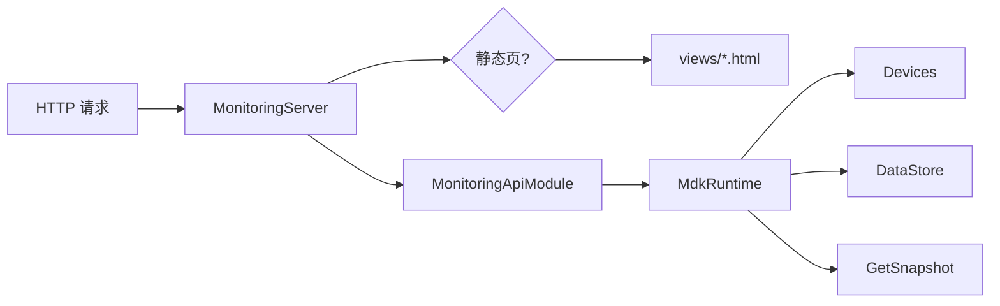

# 监控服务与 HTTP API

运行时通过 `MonitoringServer`（`HttpListener`）提供静态 HMI 页面与 REST API。监听地址由配置项 `monitoringPrefix` 决定，默认 `http://127.0.0.1:5080/`（同时注册 `localhost` 别名）。

## 架构

- 静态页在构建时复制到输出目录 `views/`，由 `*Page.cs` 在启动时读入内存
- API 模块按 `RoutePrefix` 匹配，**更具体的前缀先注册**
- 扩展模块通过 `MonitoringModuleRegistry` 注入（Serial/TCP）

## 静态页面

| URL | 文件 | 功能 |
|-----|------|------|
| `/`、`/index.html` | `index.html` | HMI 导航首页 |
| `/monitoringpage.html` | `monitoringpage.html` | 综合运行时监控 |
| `/monitorIO.html` | `monitorIO.html` | DI/DO 分栏、筛选、DO 写入 |
| `/monitorPlatform.html` | `monitorPlatform.html` | 平台步进示教 |
| `/debugSerialDev.html` | `debugSerialDev.html` | 串口调试 |

平台示教页设计说明：`src/views/motiorplatform.md`。

## REST API 概览

### 运行时快照

| 路由 | 方法 | 说明 |
|------|------|------|
| `/api/status` | GET | 完整运行时快照（项目名、运行状态、驱动、设备、变量、任务） |

快照由 `MdkRuntime.GetSnapshot()` 生成，设备项按类型附带扩展字段：

- `gpio` / `vio` → `gpioIoPoints`
- `platform` → `platformAxes`、`driverType` 如 `platform-xyz`
- `serialdev` → `serialPortInfo`

### IO 写入

| 路由 | 方法 | 说明 |
|------|------|------|
| `/api/io/write` | POST | 写数字输出（`gpio` / `vio`），body：`deviceId`、`alias`、`value` |

### 设备

| 路由 | 方法 | 说明 |
|------|------|------|
| `/api/devices` | GET | 列出所有设备 |
| `/api/devices/{id}` | GET | 单设备详情 |
| `/api/devices/{id}/action` | POST | 执行设备 action，body：`action` + `parameters` |

常用 action 示例：`write`/`read`（GPIO/VIO）、`enable`/`move`（轴/平台）、串口 open/write/read（Extensions）。

### 串口（Extensions）

| 路由 | 方法 | 说明 |
|------|------|------|
| `/api/serial/status` | GET | 查询 `deviceId` 对应串口状态 |
| `/api/serial/open` | POST | 打开端口 |
| `/api/serial/close` | POST | 关闭端口 |
| `/api/serial/write` | POST | 发送文本 |
| `/api/serial/writeBin` | POST | 发送二进制 |
| `/api/serial/read` | POST | 读取数据 |
| `/api/serial/discard` | POST | 清空缓冲区 |

### TCP（Extensions）

TCP 相关端点由 `TcpApiModule` 提供，前缀 `/api/tcp/`（与 serial 模块对称，具体路由见 `api_tcp_module.cs`）。

### 配方

| 路由 | 方法 | 说明 |
|------|------|------|
| `/api/recipes` | GET | 列出配方 |
| `/api/recipes/{id}` | GET | 单配方详情 |
| `/api/recipes/apply` | POST | 应用配方到 vars |
| `/api/recipes/capture` | POST | 从当前 vars 捕获配方 |

### 排单（生产订单）

| 路由 | 方法 | 说明 |
|------|------|------|
| `/api/orders` | GET | 列表，可选 `?status=` |
| `/api/orders` | POST | 创建订单 |
| `/api/orders/{id}` | GET/PATCH/DELETE | 查询、更新、删除 |

数据持久化在 SQLite，详见 [data-persistence.md](./data-persistence.md)。

### 示教点

| 路由 | 方法 | 说明 |
|------|------|------|
| `/api/teach/files` | GET | 列出平台示教点文件 |
| `/api/teach/point` | POST/GET/DELETE | 增删查示教点 |

### 任务

| 路由 | 方法 | 说明 |
|------|------|------|
| `/api/tasks` | GET | 运行时任务快照（名称、间隔、状态等） |

供 Task Manager 与监控页展示。

## 模块注册顺序

`MonitoringServer` 构造函数中的顺序（影响路径匹配）：

1. `StatusApiModule`
2. `IoApiModule`
3. `DevicesApiModule`
4. `MonitoringModuleRegistry.CreateModules`（Serial、TCP 等）
5. `RecipeApiModule`
6. `OrdersApiModule`
7. `TeachApiModule`
8. `TaskApiModule`

运行时可通过 `AddModule` 在 `Start()` 前追加模块。

## 监听与故障

- 前缀须以 `/` 结尾
- Windows 上若端口被占用或 URL 被保留，启动抛出 `HttpListenerException`；日志提示修改 `monitoringPrefix`
- 为避免 http.sys 冲突，默认不注册 `[::1]`，使用 `127.0.0.1` / `localhost`

## 安全说明（当前版本）

- 无鉴权、无 HTTPS
- 监听 loopback，适合本地开发与工控单机
- 生产部署如需暴露网络，应另行增加认证、TLS 或反向代理

可选后续：WebSocket 推送快照、HTTP 鉴权。

## 延伸阅读

- [architecture.md](./architecture.md) — 监控层在整体中的位置
- [gui.md](./gui.md) — WinForms 如何消费同一快照 API
