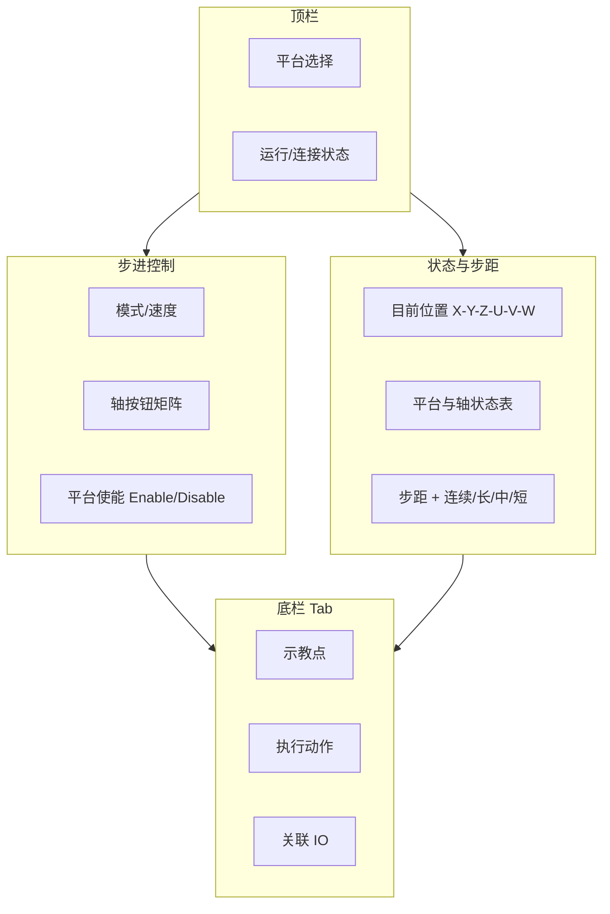

# 平台设备调试页 — 步进示教（设计说明）

> **目标页面**：`monitorPlatform.html`（实现稿）  
> **本文档**：`motiorplatform.md`  
> **对标参考**：机器人管理器 →「步进示教」界面（见项目 `assets/` 中参考截图）  
> **调试对象**：运行时 `PlatformDevice`（多轴平台，`MPlatformKind`：XY / XYZ / XYZU / XYZUV / XYZUVW）

---

## 1. 页面定位

| 项 | 说明 |
|---|---|
| 名称 | **平台步进示教**（Platform Jog / Step Teach） |
| 用途 | 在监控 HTTP 服务下，对单个 `PlatformDevice` 做联调：查看各轴位置、步进/连续点动、使能/去使能、保存/回放示教点（二期） |
| 入口 | `GET /monitorPlatform.html?deviceId={platformId}`；无参数时从 `GET /api/devices` 筛选 `type` 为 `platform` / `xy` / `xyz` … 的设备列表 |
| 风格 | 与 `debugserialdev.html`、`monitoringpage.html` 一致：深色面板、卡片分区、1s 轮询状态 |
| 非目标 | 不实现机械臂逆解、Hand/Elbow/Wrist 等 SCARA 专有姿态（参考图右侧「手臂方向」在平台页中替换为「平台/轴状态」） |

---

## 2. 总体布局

参考示教界面，采用 **左动右显、底栏扩展** 三栏结构（宽屏 ≥1200px）：

```
┌─────────────────────────────────────────────────────────────────────────────┐
│ 标题：平台步进示教 · {platformName} ({platformId})     [刷新] [返回监控首页] │
├──────────────────────────────┬──────────────────────────────────────────────┤
│ ① 步进控制（左，约 38%）      │ ② 状态与步距（右，约 62%）                    │
│  · 模式 / 速度               │  A. 目前位置                                  │
│  · 轴点动按钮矩阵             │  B. 平台与轴状态                              │
│  · 平台使能条                 │  C. 步进距离                                  │
├──────────────────────────────┴──────────────────────────────────────────────┤
│ ③ 底栏选项卡：示教点 | 执行动作 | 关联 IO（可选）                              │
└─────────────────────────────────────────────────────────────────────────────┘
```

窄屏（&lt;1024px）：上→下堆叠为 ① → ② → ③。

---

## 3. 区域规格

### 3.1 顶栏

| 控件 | 类型 | 行为 |
|---|---|---|
| 平台选择 | `<select>` | 数据源：`GET /api/devices`，仅 `type` ∈ `platform, xy, xyz, xyzu, xyzuv, xyzuvw`；变更后重载轴按钮与位置区 |
| 运行摘要 | 文本 + 徽章 | `GET /api/status` → `isRunning`、项目名；平台 `state`、各轴 `driverConnected`（来自 `device.platformAxes`） |
| 刷新间隔 | 只读标签 | 默认 **1s** 轮询位置；点动按下时 **100ms** 加速刷新（松开恢复） |
| 返回 | 链接 | `/` 或 `monitoringpage.html` |

---

### 3.2 ① 步进控制（对标参考图左侧「步进」）

#### 3.2.1 模式 / 速度

| 控件 | 选项 | 映射（一期） | 映射（二期，需 runtime） |
|---|---|---|---|
| 模式 (O) | 默认 / 关节 / 相对世界 | UI 状态；一期仅「默认」生效 | `coordinateMode`: `world` \| `joint` |
| 速度 (D) | 低 / 中 / 高 | 映射点动 `velocity` 倍率：0.25 / 0.5 / 1.0 | 写入 vars 或 action 参数 |

#### 3.2.2 轴点动按钮矩阵

按 `MPlatformKind` **动态生成**，仅显示当前平台拥有的轴字母：

| Kind | 可用轴 | 单位（显示） |
|---|---|---|
| Xy | X, Y | X/Y：mm（或配置单位） |
| Xyz | X, Y, Z | Z：mm |
| XyzU | + U | U：deg |
| XyzUv | + V | V：deg |
| XyzUvw | + W | W：deg |

**布局**（三列网格，与参考图一致；无轴的格子不渲染）：

```
列1          列2          列3
+X  -X       -Y  +Y       +Z  -Z
+Y  -Y       -V  +V       -W  +W   （仅 xyzuv / xyzuvw）
-U  +U       +S  -S       +T  -T   （MDKOSS 无 R/S/T 轴，不显示）
```

- 按钮标签：`+X`、`-X` …；图标可用 Unicode 箭头或 SVG，主色 `--accent`，禁用态 `--muted`。
- **按下**：`mousedown` / `touchstart` 开始点动；`mouseup` / `mouseleave` / `touchend` 停止。
- **禁用条件**：平台或该轴 `driverOnline === false`；未 `enable` 且驱动要求使能（如 `drvsim`）；`runtime.isRunning === false` 时显示警告条但仍允许调试（与串口页一致，可配置）。

#### 3.2.3 点动动作（一期实现路径）

平台子轴在运行时 ID 为 `{platformId}.{letter}`（例：`dev-platform-kind-xyz.X`）。

| 步进模式 | HTTP 调用 |
|---|---|
| 步进（离散） | `POST /api/devices/{platformId}.{letter}/action` body: `{ "action": "move", "parameters": { "position": current + sign * step } }` |
| 连续（按住） | 同上，每 **80–120ms** 重复；或二期 `action: "jog"` + `direction` + `stopOnRelease` |

`current` 从 vars 解析，键名规则：

```text
device.{axisDeviceName}.{axisDeviceId}.position
```

例：`device.Platform kind=xyz.dev-platform-kind-xyz.X.position`

**平台级使能**（按钮条）：

```http
POST /api/devices/{platformId}/action
{ "action": "enable" }   // PlatformDevice.SetMotion(true)
{ "action": "disable" }
```

单轴使能（可选，高级）：

```http
POST /api/devices/{platformId}.{letter}/action
{ "action": "enable" | "disable" }
```

---

### 3.3 ② 状态与步距（对标参考图右侧）

#### A. 目前位置

| 字段 | 控件 | 数据源 |
|---|---|---|
| X, Y, Z | 只读数值框，3 位小数 | 对应子轴 `*.position` var |
| U, V, W | 同上；平台无该轴时 **灰显占位** `--` | 同左 |
| 坐标系 | 单选：世界 (W) / 关节 (J) / 脉冲 (U) | 一期：**关节**=各轴独立读数；**世界**=同关节（无 FK）；**脉冲**=只读显示驱动原始值（若 var 存在） |

轮询：`GET /api/status` → `vars` 过滤当前 `platformId` 下所有 `*.position`。

#### B. 平台与轴状态（替代参考图「目前的手臂方向」）

| 块 | 内容 |
|---|---|
| 平台 | `platformKind`（xy/xyz/…）、`motionEnabled`、`state` |
| 轴表 | 列：轴、子设备 ID、driverId、驱动在线、使能、最后错误（若有 `*.error` var） |
| 详情 | `GET /api/devices/{platformId}` → `platformAxes[]` |

不展示 Hand / Elbow / Wrist；若后续接 SCARA，可在此区增加折叠面板「机械臂姿态（扩展）」。

#### C. 步进距离

| 控件 | 说明 |
|---|---|
| 每轴输入 X…W | 数字框；单位与轴一致；默认见下表 |
| 预设单选 | **连续 (C)**：按住即动，不按步距累加；**长 (L) / 中 (M) / 短 (S)**：一键填入各轴步距 |

默认步距建议（可 localStorage 记忆）：

| 预设 | 直线轴 (mm) | 旋转轴 (deg) |
|---|---|---|
| 长 L | 10 | 5 |
| 中 M | 1 | 1 |
| 短 S | 0.1 | 0.1 |

连续模式下步距输入只读；步进模式下每次点击 ± 按钮使用对应轴步距。

---

### 3.4 ③ 底栏选项卡

#### Tab 1：示教点（对标「示教点」）

| 控件 | 行为 |
|---|---|
| 点文件 (P) | 下拉：`localStorage` 或 `configs/teach/{platformId}.json`（二期服务端） |
| 点 (P) | 列表 P0…Pn；显示名称与是否已定义 |
| 示教 (T) | 将当前各轴 `position` 写入选中点 |
| 定位 / 运行 | 对所有轴依次 `move` 到记录位置（需先 enable） |
| 退出 (E) | 关闭页或返回监控首页 |

**点数据结构（JSON）**：

```json
{
  "platformId": "dev-platform-kind-xyz",
  "kind": "xyz",
  "points": [
    { "id": "P0", "name": "Home", "axes": { "X": 0, "Y": 0, "Z": 0 } }
  ]
}
```

一期：仅浏览器 `localStorage` + 导出/导入 JSON 文件；不写回 `sample.setting.json`。

#### Tab 2：执行动作

| 项 | 说明 |
|---|---|
| 平台动作 | enable / disable（同上） |
| 自定义 | 文本框输入 `action` + JSON `parameters`，`POST .../action`（调试 API） |
| 日志 | 显示最近一次请求/响应（与串口调试页收发区类似） |

#### Tab 3：关联 IO（可选）

从 `GET /api/status` 列出同项目 `gpio` / `vio` 设备，只读监视 + 快捷跳转 `monitorIO.html`；不在此页直接写 DO（避免误触）。

---

## 4. 与参考界面的差异对照

| 参考图（机器人管理器） | 本平台页（PlatformDevice） |
|---|---|
| 轴 R, S, T | **不显示**（`MPlatformKind` 无此轴） |
| 手臂方向 Hand/Elbow/Wrist | **平台与轴状态**表 |
| 世界/关节/脉冲 | 保留 UI；一期关节=分轴位置，世界/脉冲为占位或只读扩展 |
| 示教点 `.pts` 文件 | JSON + localStorage（命名可 `.pts.json`） |
| 夹具 Tab | 三期或链接到外设 GPIO 页 |

---

## 5. HTTP / 运行时依赖

### 5.1 已有 API（直接可用）

| 方法 | 路径 | 用途 |
|---|---|---|
| GET | `/api/status` | 轮询 `vars`、`devices`、`isRunning` |
| GET | `/api/devices` | 平台列表 |
| GET | `/api/devices/{id}` | `platformAxes`、状态 |
| POST | `/api/devices/{id}/action` | `enable` / `disable` / `move`（轴设备） |

### 5.2 建议扩展（二期，写入 `MdkRuntime`）

| action | device | parameters | 说明 |
|---|---|---|---|
| `jog` | `{platformId}.{letter}` | `direction`: ±1, `mode`: `step`\|`continuous`, `step?`, `velocity?` | 按住连续、松开停止 |
| `jogStop` | 同上 | — | 停止当前轴 |
| `readPositions` | `{platformId}` | — | 返回 `{ "X": 1.2, ... }` 聚合，减少前端解析 vars |
| `teach` / `gotoPoint` | `{platformId}` | `pointId`, `file?` | 服务端示教点（可选） |

文档化时一期前端**不得假设**二期 API 已存在；应用 `move` + vars 解析完成 MVP。

---

## 6. 前端实现要点（`monitorPlatform.html`）

1. **CSS 变量**：复用 `debugserialdev.html` 的 `:root` 色板与 `.card` / `.btn` / `.form-group`。
2. **设备发现**：启动时 `fetch('/api/devices')` → 过滤平台族 → 若 URL 带 `deviceId` 则选中。
3. **轴按钮生成**：根据选中设备的 `driverType` 或详情接口返回的 `platformAxes.length` 与 kind 枚举生成矩阵（kind 可从 vars `device.*.{platformId}.platformKind` 读取）。
4. **防抖**：连续点动使用 `requestAnimationFrame` 或 `setInterval(100)`，松开必须 `clearInterval` 并可选发 `disable`（仅当实现 jogStop）。
5. **错误提示**：`action` 失败时顶部 toast：`error` 字段 + 轴名。
6. **无障碍**：按钮 `aria-label` 为「X 轴正向步进」；键盘不支持连续按住时可改为单击步进。

### 6.1 路由注册（C#）

与 `DebugSerialDevPage` 同级新增：

- `src/core/monitoring/monitorplatformpage.cs` → 读取 `views/monitorPlatform.html`
- `monitoringserver.cs`：`GET /monitorPlatform.html` 返回该 HTML

`MDKOSS.csproj` 已包含 `views/**/*` 复制规则，无需改 csproj。

---

## 7. 联调检查清单

- [ ] `sample.setting.json` 中至少一个 `platform` / `xyz` 设备已 `enabled`
- [ ] 对应轴驱动 `drv-sim` 或 `drv-main` 已连接
- [ ] 打开 `http://127.0.0.1:5080/monitorPlatform.html?deviceId=dev-platform-kind-xyz`
- [ ] 使能后单轴 ± 步进，`vars` 中 `position` 变化
- [ ] `xyzuvw` 设备显示 6 轴按钮；`xy` 仅 4 个（±X ±Y）
- [ ] 驱动离线时按钮禁用、状态区红色提示
- [ ] 示教点保存/导出 JSON 再导入可恢复

---

## 8. 线框（MVP）



---

## 9. 文件清单

| 文件 | 角色 |
|---|---|
| `src/views/motiorplatform.md` | 本设计说明 |
| `src/views/monitorPlatform.html` | 页面实现（待开发） |
| `src/core/monitoring/monitorplatformpage.cs` | 静态页加载器（待开发） |
| `src/core/mdev.cs` | `PlatformDevice` / `MPlatformKind` |
| `src/core/mdk.cs` | `ExecuteDeviceAction` |
| `src/core/monitoring/monitoringserver.cs` | HTTP 路由 |

---

## 10. 版本规划

| 版本 | 范围 |
|---|---|
| **MVP** | 布局 + 平台选择 + 位置轮询 + 步进按钮 + 平台 enable/disable + localStorage 示教点 |
| **v1.1** | `jog` / `jogStop`、聚合 `readPositions`、GTS/仿真速度曲线 |
| **v1.2** | 服务端示教点文件、与任务脚本互锁（运行中禁止点动） |

---

*文档版本：2026-05-16 · 对齐 MDKOSS `PlatformDevice` 与监控 HTTP 现有能力*
